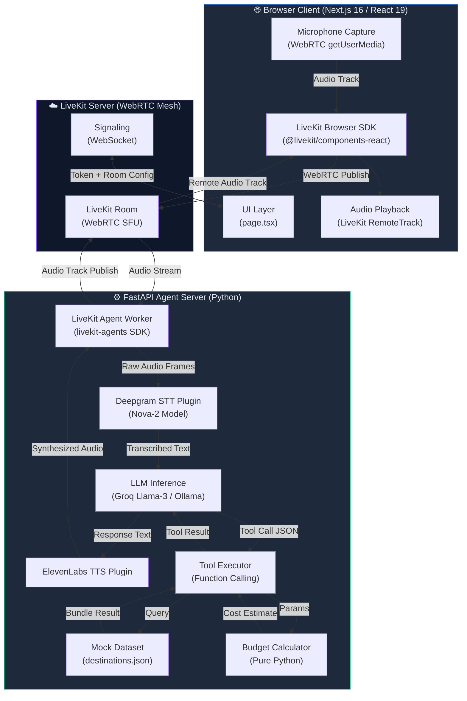
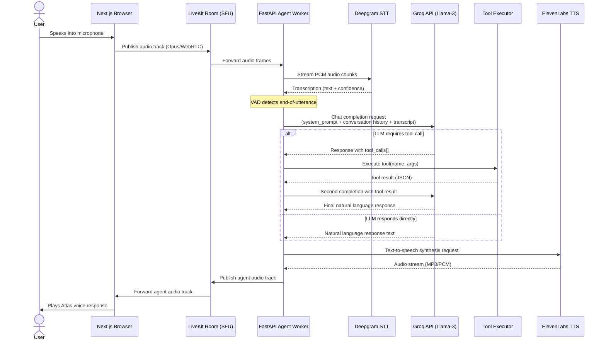
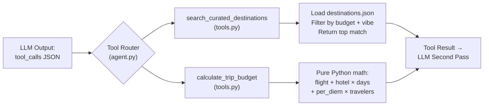
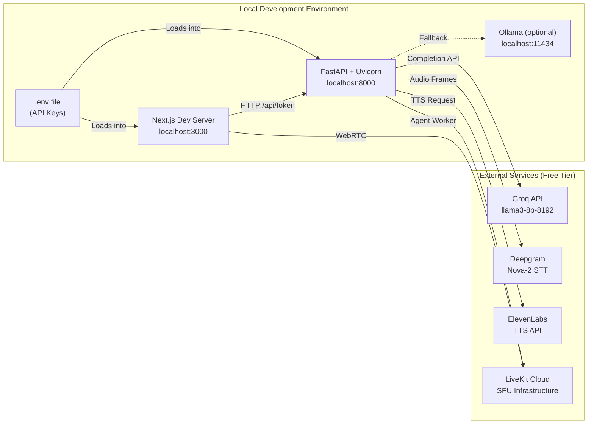

# Architecture Document
## Travel Planning & Booking Agent — *Atlas*

> **Document Version:** 1.0  
> **Status:** Draft  
> **Last Updated:** 2026-06-19  
> **Owner:** Capstone Engineering Team

---

## Table of Contents

1. [High-Level System Architecture](#1-high-level-system-architecture)
2. [Component Breakdown](#2-component-breakdown)
3. [Data Flow: STT → LLM → TTS Pipeline](#3-data-flow-stt--llm--tts-pipeline)
4. [Tool Integration & Function Calling Logic](#4-tool-integration--function-calling-logic)
5. [LLM Prompt Strategy](#5-llm-prompt-strategy)
6. [Infrastructure & Dependency Map](#6-infrastructure--dependency-map)
7. [Security & Configuration](#7-security--configuration)

---

## 1. High-Level System Architecture

The Atlas system is composed of three logical layers: a **browser client**, a **real-time transport mesh** (LiveKit), and a **FastAPI agent server**. All layers communicate asynchronously over WebRTC audio streams and WebSocket signaling.



---

## 2. Component Breakdown

### 2.1 Frontend — Next.js Client (`/client/travel-agent`)

The frontend is a **Next.js 16** application using the App Router paradigm with **Tailwind CSS v4** for styling. Its sole responsibility is to establish a LiveKit WebRTC room connection, publish the user's microphone track, and subscribe to the agent's audio track for playback.

| File | Responsibility |
|---|---|
| `app/layout.tsx` | Root layout, font configuration, global CSS injection |
| `app/page.tsx` | Primary UI — connection controls, voice activity indicator, session state |
| `app/globals.css` | Tailwind base styles and custom design tokens |
| `next.config.ts` | Next.js runtime configuration (image domains, env vars) |

**Key SDK Integration:**

```typescript
// Conceptual LiveKit connection pattern in page.tsx
import { LiveKitRoom, useVoiceAssistant } from "@livekit/components-react";

// Token fetched from FastAPI /token endpoint
const { token } = await fetch("/api/token").then(r => r.json());

// Agent audio track automatically subscribed and played
const { audioTrack } = useVoiceAssistant();
```

**Technology Versions:**

| Dependency | Version |
|---|---|
| `next` | 16.2.9 |
| `react` | 19.2.4 |
| `tailwindcss` | ^4.0 |
| `@livekit/components-react` | latest |

---

### 2.2 Transport Layer — LiveKit SFU

LiveKit acts as the **real-time audio relay** between browser and agent. It is a Selective Forwarding Unit (SFU) that routes WebRTC audio tracks between participants in a room.

| Concept | Role in Atlas |
|---|---|
| **Room** | Isolated session namespace; one room per user session |
| **Participant** | Browser client (user) + Agent worker (Atlas) |
| **Track** | User microphone → Agent receives; Agent TTS output → User plays |
| **Token** | JWT signed with `LIVEKIT_API_KEY` + `LIVEKIT_API_SECRET`; grants room access |
| **Dispatch** | FastAPI triggers `AgentDispatch` to assign the Atlas worker to the room |

**Local Development:** LiveKit Cloud free tier is used. The `lk` CLI tool is used to generate dev tokens.

---

### 2.3 Backend Agent — FastAPI + LiveKit Agents SDK (`/server`)

The server is a **FastAPI** application that also bootstraps a **LiveKit Agents worker process**. The worker connects to the LiveKit room and drives the full STT→LLM→TTS pipeline.

| Module | Responsibility |
|---|---|
| `main.py` | FastAPI app entrypoint; health check route; token generation endpoint |
| `agent.py` *(planned)* | LiveKit Agent definition; pipeline assembly; tool registration |
| `tools.py` *(planned)* | `search_curated_destinations` + `calculate_trip_budget` implementations |
| `data/destinations.json` *(planned)* | Mock dataset of curated travel bundles |

**Pipeline Assembly Pattern:**

```python
# Conceptual agent.py structure
from livekit.agents import AutoSubscribe, JobContext, WorkerOptions, cli
from livekit.agents.voice_assistant import VoiceAssistant
from livekit.plugins import deepgram, elevenlabs, openai  # openai-compat for Groq

async def entrypoint(ctx: JobContext):
    await ctx.connect(auto_subscribe=AutoSubscribe.AUDIO_ONLY)

    assistant = VoiceAssistant(
        vad=...,               # Voice Activity Detection
        stt=deepgram.STT(),    # Deepgram Nova-2
        llm=openai.LLM(        # Groq OpenAI-compatible endpoint
            model="llama3-8b-8192",
            base_url="https://api.groq.com/openai/v1",
            api_key=GROQ_API_KEY
        ),
        tts=elevenlabs.TTS(),  # ElevenLabs synthesis
        fnc_ctx=atlas_tools,   # Registered tool context
        chat_ctx=initial_ctx,  # System prompt + greeting
    )
    assistant.start(ctx.room)
```

---

## 3. Data Flow: STT → LLM → TTS Pipeline

This section details the exact sequence of events from the moment a user speaks to when Atlas responds.



### 3.1 Latency Budget Breakdown

| Stage | Target Latency | Notes |
|---|---|---|
| Browser mic → LiveKit | ~30ms | WebRTC sub-frame latency |
| LiveKit → Agent | ~20ms | SFU forwarding |
| Deepgram STT | ~150–300ms | Streaming transcription |
| VAD end-of-utterance detection | ~200ms | Configurable silence threshold |
| Groq LLM (no tool call) | ~400–700ms | Llama-3-8b is fastest Groq model |
| Tool execution (local) | ~1–5ms | Pure Python / JSON file read |
| Groq LLM (with tool result) | ~400ms | Second completion request |
| ElevenLabs TTS first chunk | ~300–500ms | Streaming synthesis |
| LiveKit → Browser playback | ~30ms | SFU forwarding |
| **Total (no tool call)** | **~1.1–1.7s** | Within 2.5s target |
| **Total (with tool call)** | **~1.5–2.2s** | Within 2.5s target |

---

## 4. Tool Integration & Function Calling Logic

### 4.1 Architecture of Function Calling Without Real APIs

Atlas uses the **OpenAI-compatible function calling** protocol natively supported by Groq's Llama-3 inference endpoint. The LLM does not call external services; instead, it emits a structured JSON payload that the **Agent Worker intercepts and routes to local Python functions**.



### 4.2 Tool Definitions

#### `search_curated_destinations`

```python
@llm.ai_callable(description="Search for a curated flight and hotel bundle matching the user's budget tier and travel vibe.")
async def search_curated_destinations(
    budget: Annotated[str, llm.TypeInfo(description="Budget tier: 'budget', 'mid', or 'luxury'")],
    vibe: Annotated[str, llm.TypeInfo(description="Travel vibe: 'beach', 'culture', 'adventure', 'city', 'wellness'")]
) -> str:
    """
    Reads from a local mock dataset and returns exactly one
    flight + hotel bundle matching the specified budget and vibe.
    """
    dataset = load_destinations()  # Reads data/destinations.json
    match = next(
        (d for d in dataset if d["budget"] == budget and d["vibe"] == vibe),
        dataset[0]  # Fallback to first entry if no exact match
    )
    return json.dumps(match)
```

**Mock Dataset Schema** (`data/destinations.json`):

```json
[
  {
    "id": "hvar-croatia-mid-beach",
    "destination": "Hvar, Croatia",
    "budget": "mid",
    "vibe": "beach",
    "flight": {
      "route": "JFK → DBV",
      "price_usd": 480,
      "airline": "Lufthansa",
      "duration_hours": 11
    },
    "hotel": {
      "name": "Villa Nora Boutique",
      "price_per_night_usd": 120,
      "stars": 4,
      "highlights": "Cliffside sea view, rooftop pool"
    },
    "tags": ["beach", "mid", "off-the-beaten-path", "summer"]
  }
]
```

---

#### `calculate_trip_budget`

```python
@llm.ai_callable(description="Calculate an estimated total trip budget based on destination, duration, and number of travelers.")
async def calculate_trip_budget(
    destination: Annotated[str, llm.TypeInfo(description="Destination city/country name")],
    days: Annotated[int, llm.TypeInfo(description="Number of trip days")],
    travelers: Annotated[int, llm.TypeInfo(description="Number of travelers")]
) -> str:
    """
    Pure Python budget estimation. Uses per-diem rates from a
    local rate table indexed by destination. No external API calls.
    """
    rate = get_per_diem(destination)  # Local lookup table
    hotel_total = rate["hotel_per_night"] * days
    food_total = rate["food_per_day"] * days * travelers
    activities_total = rate["activities_per_day"] * days
    flight_estimate = rate["avg_flight_usd"]
    
    total = hotel_total + food_total + activities_total + flight_estimate
    
    return json.dumps({
        "destination": destination,
        "days": days,
        "travelers": travelers,
        "breakdown": {
            "flights": flight_estimate,
            "hotels": hotel_total,
            "food": food_total,
            "activities": activities_total
        },
        "total_estimate_usd": total
    })
```

### 4.3 Tool Trigger Logic (System Prompt Enforcement)

The LLM is explicitly instructed via the system prompt when to call each tool:

| Signal in Conversation | Tool Triggered |
|---|---|
| `budget` AND `vibe` are both known | `search_curated_destinations` |
| User says "how much", "total cost", "full budget" | `calculate_trip_budget` |
| Neither signal is present | Ask clarifying question (max 2 total) |

---

## 5. LLM Prompt Strategy

### 5.1 System Prompt (Full)

```
You are Atlas, a premium AI travel concierge. Your personality is warm,
confident, and decisive — like a trusted friend who happens to have
encyclopedic knowledge of global travel.

RULES YOU MUST FOLLOW WITHOUT EXCEPTION:
1. Keep ALL responses to a maximum of 3 sentences. Never exceed this.
2. Never use bullet points, numbered lists, or markdown formatting.
   Your output is spoken aloud — write for the ear, not the eye.
3. Ask a maximum of 2 clarifying questions across the entire session
   before invoking search_curated_destinations. Do not over-qualify.
4. When you have the user's budget tier and travel vibe, immediately
   call search_curated_destinations — do not ask more questions.
5. Present the tool result as your own confident recommendation.
   Never say "the tool returned" or expose internal mechanics.
6. Never invent flight numbers, real hotel booking URLs, or actual
   availability. All recommendations come from your tool calls.
7. End every recommendation with an implicit next-step question,
   such as "Want me to calculate the full trip cost for you?"

BUDGET TIERS: "budget" (< $1,000/person), "mid" ($1,000–$3,000),
              "luxury" (> $3,000)
VIBE OPTIONS: "beach", "culture", "adventure", "city", "wellness"

BEGIN: Greet the user warmly and ask where their next adventure is
taking them. Keep it to one sentence.
```

### 5.2 Conversation Context Management

The agent maintains a rolling **conversation history** passed to each LLM completion request. To stay within Llama-3's 8,192 token context window:

- Maximum **10 turns** of history are retained.
- Tool results are **summarized** after being consumed, not raw-stored.
- The system prompt is **always prepended** at position 0.

### 5.3 Why Groq with Llama-3 (Not GPT-4)

| Factor | Groq + Llama-3-8b | OpenAI GPT-4o |
|---|---|---|
| Latency | ~400ms | ~1,200ms |
| Cost | Free tier (14,400 req/day) | $0.005/1K tokens |
| Function calling | ✅ Native support | ✅ Native support |
| Context window | 8,192 tokens | 128K tokens |
| Offline fallback | Ollama (local) | ❌ Cloud-only |
| Capstone constraint | ✅ $0 cost | ❌ Paid |

---

## 6. Infrastructure & Dependency Map



### 6.1 Python Dependencies (`/server`)

```
livekit-agents[deepgram,elevenlabs,openai,silero]
fastapi
uvicorn
python-dotenv
httpx
```

### 6.2 Node.js Dependencies (`/client/travel-agent`)

```
next@16.2.9
react@19.2.4
@livekit/components-react
@livekit/client
tailwindcss@^4
typescript@^5
```

---

## 7. Security & Configuration

### 7.1 Environment Variables

All secrets are managed via a `.env` file at the project root. **This file must never be committed to version control.**

| Variable | Service | Required |
|---|---|---|
| `LIVEKIT_URL` | LiveKit Cloud | ✅ |
| `LIVEKIT_API_KEY` | LiveKit Cloud | ✅ |
| `LIVEKIT_API_SECRET` | LiveKit Cloud | ✅ |
| `GROQ_API_KEY` | Groq API | ✅ (or Ollama) |
| `DEEPGRAM_API_KEY` | Deepgram | ✅ |
| `ELEVEN_API_KEY` | ElevenLabs | ✅ |
| `OLLAMA_BASE_URL` | Local Ollama | Optional |
| `NEXT_PUBLIC_LK_TOKEN_ENDPOINT` | Client → FastAPI | ✅ |

### 7.2 Token Security Model

LiveKit room access tokens are **short-lived JWTs** (default 10-minute TTL) generated server-side by FastAPI using the `LIVEKIT_API_KEY` + `LIVEKIT_API_SECRET`. The browser client never has access to the API secret — it only receives the signed token via the `/api/token` endpoint, which is rate-limited per session.
